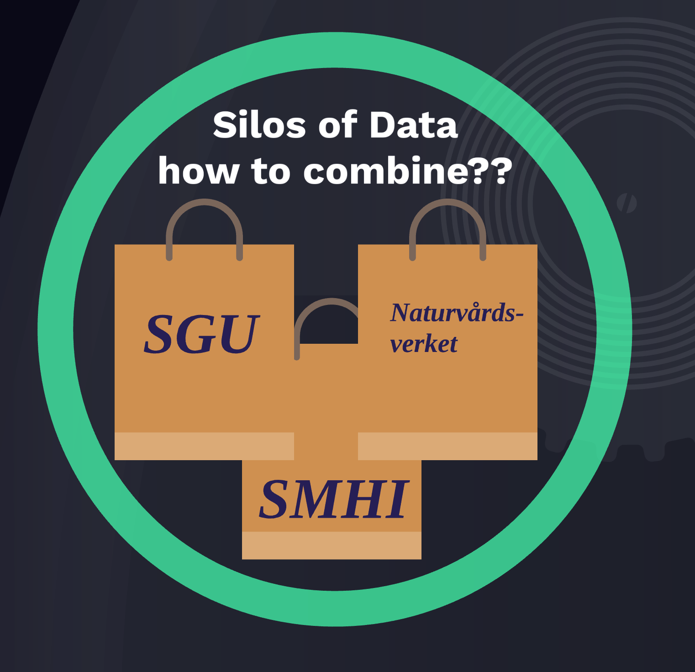
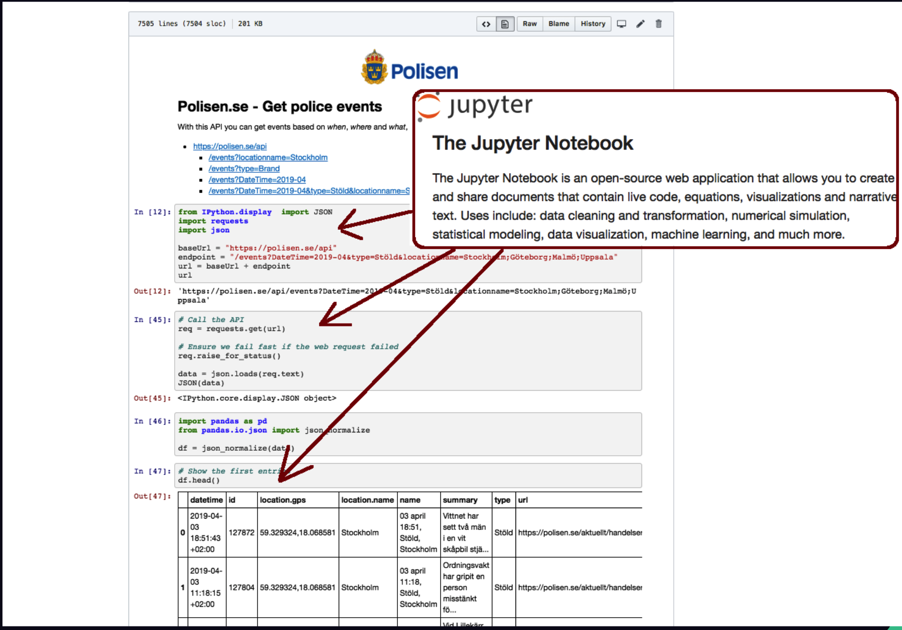
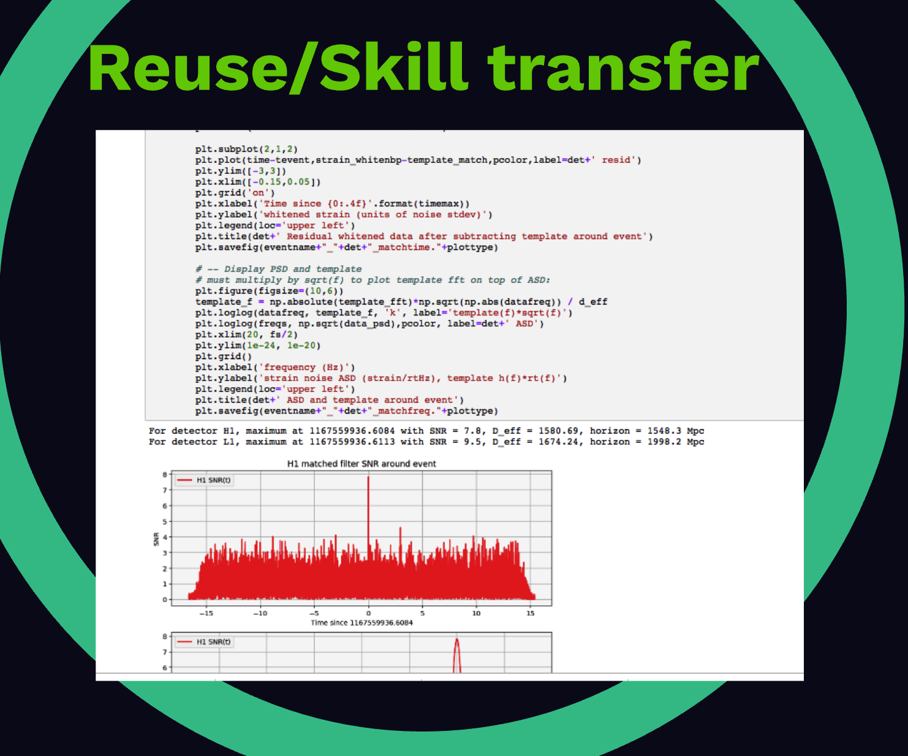

# Wikidata 2020 maj 14 Linked-data-Sweden presentation
* Magnus Sälgö [Q63281996](https://www.wikidata.org/wiki/Q63281996)
* [event](https://www.eventbrite.com/e/lankade-data-i-sverige-online-event-tickets-104745955974?fbclid=IwAR3BqfogVRg2GpUG2hmob8ryvBncrrLc5hlk6e2Y6nw3HNdTZcGGydI1pe0) 
  * [video vid 1:00:00](https://www.crowdcast.io/e/lankade-data-i-sverige?utm_source=crowdcast&utm_medium=email&utm_campaign=followers)
  * se [Google Presentation](https://docs.google.com/presentation/d/148MMhGNmO9LopsVnh2RR9W3BXnymj3eZTXwU08Z1mlk/edit?usp=sharing)
  * [Presentation 2019](https://github.com/salgo60/Wikidata-Sustainable-Knowledge-Graphs) 
* mer info
  * Wikidata 
    * what is it [video](https://www.youtube.com/watch?v=lmWmMIuCJVM)
    * 2019 oktober "Glimpse over Wikidata" Lydia Pintscher [Q18016466](https://www.wikidata.org/wiki/Q18016466) hennes presentation [video](https://media.ccc.de/v/wikidatacon2019-3-glimpse_over_wikidata)
    * Svensk Facebook grupp [Släktforskning Semantisk Web](https://www.facebook.com/groups/345973895882090)
    * Open Data [Examples - Hack for Sweden 2019](https://github.com/salgo60/open-data-examples)
      * Presentation Hack4Sweden ["Maximize the usage of Open Data"](https://prezi.com/gxli-bpyese7/open-knowledge-oppen-data)
   * iNaturalist
     * [film vimeo](https://vimeo.com/229946260) plus ett papper om iNaturalist om hur [citizen science](https://en.wikipedia.org/wiki/Citizen_science) som iNaturalist kan hjälpa forskningen -  [Morphological Change during Rapid Population Expansion Confounds Leopard Frog Identifications in the Southwestern United States](https://bioone.org/journals/copeia/volume-108/issue-2/CH-19-222/Morphological-Change-during-Rapid-Population-Expansion-Confounds-Leopard-Frog-Identifications/10.1643/CH-19-222.full) 
       * [Cool new paper about a study inspired by iNat Observations](https://forum.inaturalist.org/t/cool-new-paper-about-a-study-inspired-by-inat-observations/12351)
     * [Wikidata:WikiProject iNaturalist](https://www.wikidata.org/wiki/Wikidata:WikiProject_iNaturalist)
     * [Wikipedia Weekly Network om iNaturalist kopplingen](https://twitter.com/WikipediaWeekly/status/1258851809835102208?s=20)
     * [Creating iNaturalist places and linking to Wikidata using geojson](https://forum.inaturalist.org/t/creating-inaturalist-places-and-linking-to-wikidata-using-geojson/12220)
  * Wikilambda
    * the challenge is getting more WIkipedia knowledge in more Wikipedia languages video [Katherine Maher: "The Sum of All Knowledge"](https://youtu.be/ESVQknHESuA?t=1402) - the world is changing  
    * Proposal [Wikilambda](https://meta.wikimedia.org/wiki/Wikilambda)
    * GITHUB [prototype implementation](https://github.com/google/abstracttext)

